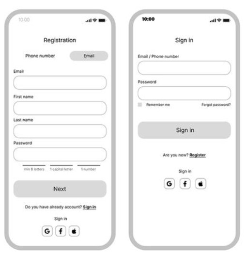

created: 10.04.25
updated: 10.04.25

Forms take user input in form fields, can be:
* text
* options from list
* calendar dates
Output can be on the submit button
* sending API request to log in user
Validation, checking if input matches the rules and constraints of the form field
* *"password must contain a special character i.e $%!@"*

See
* [Forms in Flutter](Forms%20in%20Flutter.md)
* [Forms in Hero](Forms%20in%20Hero.md)
